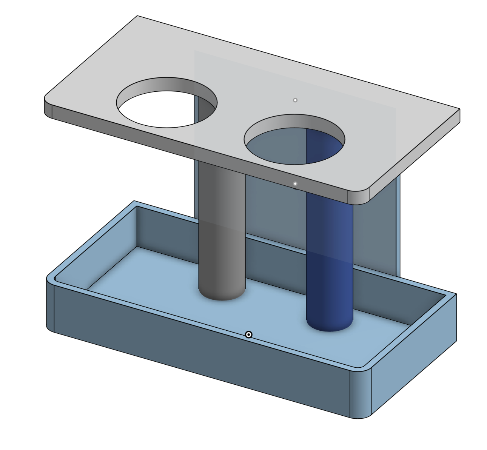

# Double-Decker-Utensil-Holder
A good solution for holding utensils vertically :)

This project was made using on-shape. I wanted more space at my table, and 
I wanted something that would fit just right in a small gap on my wall. 

Enjoy!
(more detailed read me coming soon w/ all the measurements)

